<!-- generated by generate.py -->

<picture><source media="(prefers-color-scheme: dark)" srcset="./assets/banner-dark.svg"></picture>

<picture><source media="(prefers-color-scheme: dark)" srcset="./assets/cat-observability-dark.svg"></picture>

<a href="https://github.com/h5vx/samp-monitor"><picture><source media="(prefers-color-scheme: dark)" srcset="./assets/card-samp-monitor-dark.svg"></picture></a>
<a href="https://github.com/h5vx/awg_exporter"><picture><source media="(prefers-color-scheme: dark)" srcset="./assets/card-awg_exporter-dark.svg"></picture></a>
<a href="https://github.com/h5vx/xiaomi-air-purifier-exporter"><picture><source media="(prefers-color-scheme: dark)" srcset="./assets/card-xiaomi-air-purifier-exporter-dark.svg"></picture></a>
<a href="https://github.com/h5vx/grafana-xmpp-webhook"><picture><source media="(prefers-color-scheme: dark)" srcset="./assets/card-grafana-xmpp-webhook-dark.svg"></picture></a>

<picture><source media="(prefers-color-scheme: dark)" srcset="./assets/cat-network-dark.svg"></picture>

<a href="https://github.com/h5vx/amnezia-client-android-nougat"><picture><source media="(prefers-color-scheme: dark)" srcset="./assets/card-amnezia-client-android-nougat-dark.svg"></picture></a>
<a href="https://github.com/h5vx/proxychecker"><picture><source media="(prefers-color-scheme: dark)" srcset="./assets/card-proxychecker-dark.svg"></picture></a>

<picture><source media="(prefers-color-scheme: dark)" srcset="./assets/cat-bots-dark.svg"></picture>

<a href="https://github.com/h5vx/BandPlan_bot"><picture><source media="(prefers-color-scheme: dark)" srcset="./assets/card-BandPlan_bot-dark.svg"></picture></a>
<a href="https://github.com/h5vx/ugubot"><picture><source media="(prefers-color-scheme: dark)" srcset="./assets/card-ugubot-dark.svg"></picture></a>
<a href="https://github.com/h5vx/sampboombot"><picture><source media="(prefers-color-scheme: dark)" srcset="./assets/card-sampboombot-dark.svg"></picture></a>

<picture><source media="(prefers-color-scheme: dark)" srcset="./assets/cat-tools-dark.svg">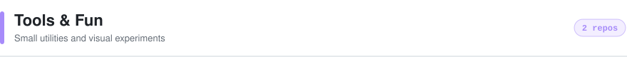</picture>

<a href="https://github.com/h5vx/pactop"><picture><source media="(prefers-color-scheme: dark)" srcset="./assets/card-pactop-dark.svg"></picture></a>
<a href="https://github.com/h5vx/MechanicalCounter3D"><picture><source media="(prefers-color-scheme: dark)" srcset="./assets/card-MechanicalCounter3D-dark.svg"></picture></a>

